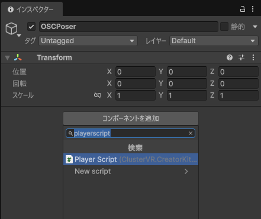
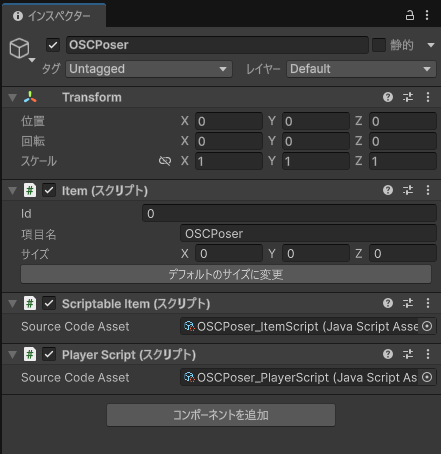

# OSCPoser

## Overview

OSCPoser is a script for the metaverse platform Cluster that allows you to pose an avatar by receiving OSC/VMC Protocol data.

## Requirements

- Cluster Creator Kit v2.30.1.3 or later

## How to Use

1. In Unity (Cluster Creator Kit), open the scene of the world where you want to use OSCPoser.
2. Add an empty GameObject.
3. Add the "Player Script" component to the GameObject you just created.
  
The "Scriptable Item" component will also be added automatically.
5. In the "Scriptable Item" component, set "Source Code Asset" to `OSCPoser_ItemScript.js`.
6. In the "Player Script" component, set "Source Code Asset" to `OSCPoser_PlayerScript.js`.
 

## Auther

Yamachan (X: [xr_ymchn](https://x.com/xr_ymchn))

## License

BSD Zero Clause License
